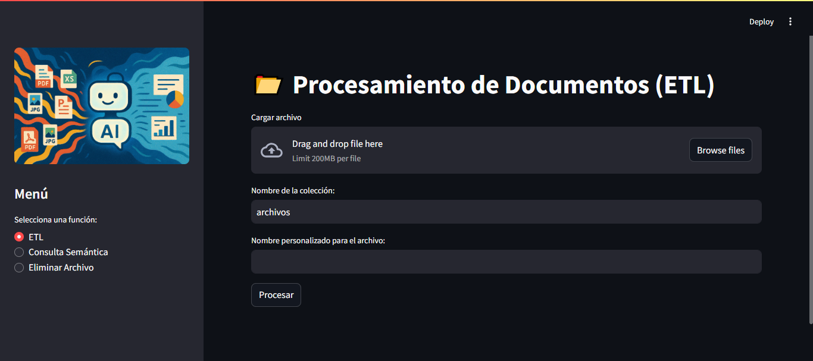
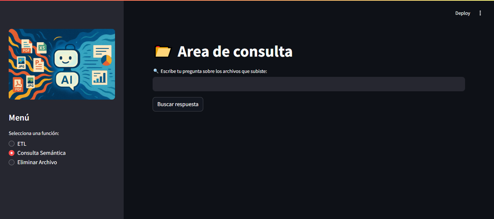
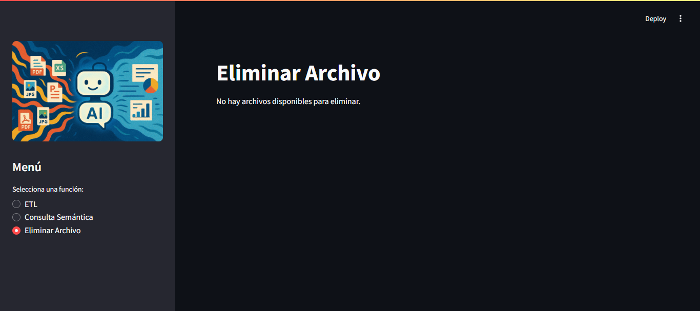

# ETL-RAG 🚀

## Descripción 📄
Herramienta para el procesamiento y consulta de datos no estructurados. Permite extraer contenido de documentos como PDFs, Word, Excel, etc., almacenarlos en MongoDB Atlas y realizar búsquedas semánticas en el contenido.

## Tecnologías Utilizadas 🛠️
- 🐍 Python
- 🌐 Streamlit (para la interfaz de usuario)
- 🍃 MongoDB Atlas (base de datos)
- 📄 Azure Document Intelligence (para extraer contenido de documentos)
- 🤖 OpenAI (para generar embeddings semánticos)

## Funcionalidades ✨
- **ETL (Extracción, Transformación, Carga)**: Carga de documentos y extracción de contenido para su posterior almacenamiento en MongoDB Atlas.
- **Consulta Semántica**: Realizar búsquedas semánticas en los documentos almacenados.
- **Eliminar Archivo**: Eliminar documentos almacenados previamente.

## Uso 🖥️
1. Iniciar la aplicación: `streamlit run app.py`
2. Navega a [http://localhost:8501](http://localhost:8501) en tu navegador para interactuar con la interfaz de usuario.

## Documentación de Código 📚
- **streamlit_ui.py**
  - `procesar_etl()`: Carga y procesa un documento, extrayendo su contenido y almacenándolo en MongoDB Atlas.
  - `realizar_consulta()`: Realiza una búsqueda semántica en los documentos almacenados.
  - `procesar_documento()`: Extrae el contenido de un documento y lo procesa para su almacenamiento.
  - `buscar_respuesta_semantica()`: Busca respuestas relevantes a una consulta semántica.
- **utils/**
  - `mongo_utils.py`: Funciones relacionadas con la interacción con MongoDB Atlas.
  - `azure_utils.py`: Funciones para extraer contenido de documentos utilizando Azure Document Intelligence.
  - `openai_utils.py`: Funciones para generar embeddings semánticos con OpenAI.
  - `file_utils.py`: Funciones para manejar archivos.

## Interfaz de Usuario 🖌️
La interfaz de usuario se desarrolla con Streamlit y consta de tres secciones principales:
- **ETL**: Permite cargar y procesar documentos.
- **Consulta Semántica**: Permite realizar consultas semánticas en los documentos almacenados.
- **Eliminar Archivo**: Permite eliminar documentos almacenados previamente.

## Capturas de Pantalla 📸
### Pantalla Principal

### Sección de Consulta Semántica

### Sección de Eliminación de Archivos

